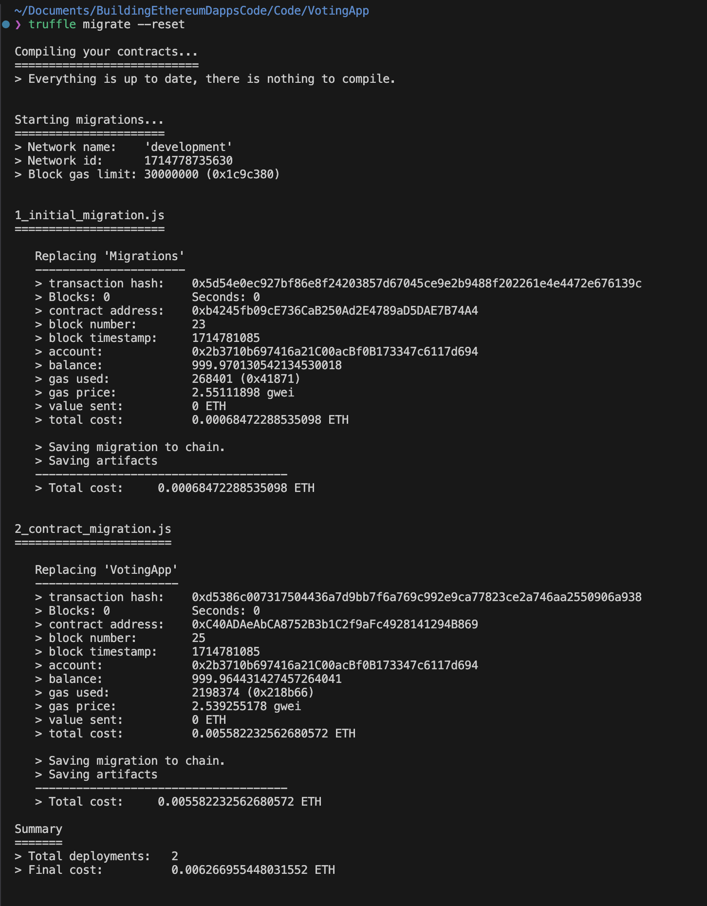
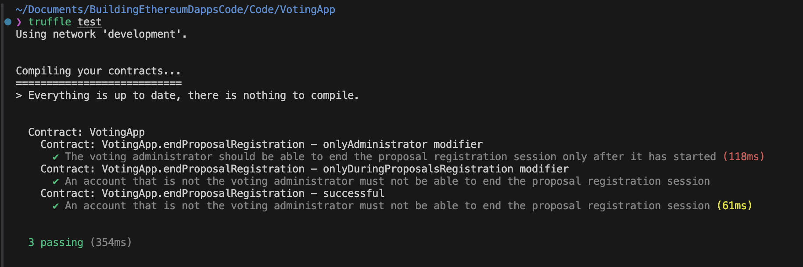

# Voting App

A Decentralized voting application using blockchain

## Objectives
The main goal of a decentralized voting app is to use blockchain technology to make the voting process more `transparent` and `secure`   
This approach can achieve the following benefits:
- **Transparency**: All blockchain transactions are immutable and publicly verifiable, enhancing transparency and reducing tampering risks.
- **Security**: Blockchain's decentralized data storage offers higher security than centralized systems, lowering hacking and corruption risks.
- **Immutability**: Blockchain records cannot be altered, ensuring the integrity of voting records.
- **Accessibility**: Anyone with internet access can vote via a decentralized app, benefiting remote voters.
- **Auditability**: Blockchain data can be audited anytime, minimize verification processes.

## Requirements
- Users can vote on proposal they're interested in
- Restricts registering proposal and voting based on status
- Shows the voting results transparently

## How to run
To run the app, you need to have Truffle(v5.11.5) installed on your machine. [Truffle Setup](https://www.npmjs.com/package/truffle)

```bash
git clone https://github.com/betternormal/voting-app.git
cd voting-app

# Compile Solidity smart contracts using truffle, compile into bytecode that can be run on EVM
truffle compile           

# Create a mock network
ganache                   

# Deploy smart contracts
truffle migrate --reset   

# Test smart contracts
truffle test              
```

## Workflow
### 1.  The Admin registers the voter's Ethereum address on the allowlist
- `onlyAdministrator`: This function can only be called by the administrator
- `onlyDuringVotersRegistration`: This function can only be called during the voter registration period
- Events are used to notify changes in the state of the blockchain

```solidity
function registerVoter(
        address _voterAddress
    ) public onlyAdministrator onlyDuringVotersRegistration {
        require(
            !voters[_voterAddress].isRegistered,
            "the voter is already registered"
        );

        voters[_voterAddress].isRegistered = true;
        voters[_voterAddress].hasVoted = false;
        voters[_voterAddress].votedProposalId = 0;

        emit VoterRegisteredEvent(_voterAddress);
    }
```


### 2.  The Admin starts the proposal registration session

- `onlyDuringVotersRegistration`: This can only be called during the voter registration period.  
- `emit ProposalsRegistrationStartedEvent()`: Triggers an event to signal that the proposal registration has started.

```solidity
function startProposalsRegistration()
        public
        onlyAdministrator
        onlyDuringVotersRegistration
    {
        workflowStatus = Status.ProposalsRegistrationStarted;

        emit ProposalsRegistrationStartedEvent();
        emit WorkflowStatusChangeEvent(
            Status.RegisteringVoters,
            workflowStatus
        );
    }
```


### 3. Voters can submit their proposals while the registration session is ongoing

- `proposals.push(Proposal({description: proposalDescription, voteCount: 0}))`: 
    - Stores the content of the proposal in the proposal object
    - Sets the current vote count for the proposal to zero
    - This object is then added to the proposals array

```solidity
function registerProposal(
        string memory proposalDescription
    ) public onlyRegisteredVoter onlyDuringProposalsRegistration {
        proposals.push(
            Proposal({description: proposalDescription, voteCount: 0})
        );

        emit ProposalRegisteredEvent(proposals.length - 1);
    }
```


### 4. The Admin ends the proposal registration session

- `onlyDuringProposalsRegistration`: This can only be called during the proposal registration period.

```solidity
function endProposalsRegistration()
        public
        onlyAdministrator
        onlyDuringProposalsRegistration
    {
        workflowStatus = Status.ProposalsRegistrationEnded;

        emit ProposalsRegistrationEndedEvent();
        emit WorkflowStatusChangeEvent(
            Status.ProposalsRegistrationStarted,
            workflowStatus
        );
    }
```


### 5. The Admin starts the voting session


```solidity
function startVotingSession()
        public
        onlyAdministrator
        onlyAfterProposalsRegistration
    {
        workflowStatus = Status.VotingStarted;

        emit VotingStartedEvent();
        emit WorkflowStatusChangeEvent(
            Status.ProposalsRegistrationEnded,
            workflowStatus
        );
    }
```


### 6. Voters vote for the proposal they like

- `!voters[msg.sender].hasVoted`: Checks if the current caller has not already voted. If the caller has already voted, the transaction fails with the message "the caller has already voted."

- `proposals[proposalId].voteCount += 1`: Increases the vote count for the specified proposal by one.

```solidity
function vote(
        uint proposalId
    ) public onlyRegisteredVoter onlyDuringVotingSession {
        require(!voters[msg.sender].hasVoted, "the caller has already voted");

        voters[msg.sender].hasVoted = true;
        voters[msg.sender].votedProposalId = proposalId;

        proposals[proposalId].voteCount += 1;

        emit VotedEvent(msg.sender, proposalId);
    }
```


### 7. The Admin ends the voting session


```solidity
function endVotingSession()
        public
        onlyAdministrator
        onlyDuringVotingSession
    {
        workflowStatus = Status.VotingEnded;

        emit VotingEndedEvent();
        emit WorkflowStatusChangeEvent(Status.VotingStarted, workflowStatus);
    }
```


### 8. The Admin counts the votes

- `for (uint i = 0; i < proposals.length; i++)`: Checks the vote count of each proposal.

- `winningProposalIndex = i`: Sets the index of the new proposal with the highest vote count.

```solidity
    function countVotes() public onlyAdministrator onlyAfterVotingSession {
        uint winningVoteCount = 0;
        uint winningProposalIndex = 0;

        for (uint i = 0; i < proposals.length; i++) {
            if (proposals[i].voteCount > winningVoteCount) {
                winningVoteCount = proposals[i].voteCount;
                winningProposalIndex = i;
            }
        }

        selectedProposalId = winningProposalIndex;
        workflowStatus = Status.VotesCounted;

        emit VotesCountedEvent();
        emit WorkflowStatusChangeEvent(Status.VotingEnded, workflowStatus);
    }
```


### 9. Anyone can check the details of the elected proposal

- `onlyAfterVotesCounted`: Can only be called after the vote counting has been completed.

- `return proposals[selectedProposalId].description`: Returns the description of the proposal that received the most votes.

- `return proposals[selectedProposalId].voteCount`: Returns the vote count of the proposal that received the most votes.

```solidity
function getWinningProposalId()
        public
        view
        onlyAfterVotesCounted
        returns (uint)
    {
        return selectedProposalId;
    }

    function getWinningProposalDescription()
        public
        view
        onlyAfterVotesCounted
        returns (string memory)
    {
        return proposals[selectedProposalId].description;
    }

    function getWinningProposaVoteCounts()
        public
        view
        onlyAfterVotesCounted
        returns (uint)
    {
        return proposals[selectedProposalId].voteCount;
    }
```

# Test cases
### 1. endProposalRegistration - onlyAdministrator modifier  
- This test verifies that the onlyAdministrator modifier functions correctly.
- It checks whether an error is raised when a `non-administrator` account attempts to `end the proposal registration session`

```js
try {
    await VotingAppInstance.endProposalsRegistration({from: nonVotingAdministrator});
    assert.fail('Non-admin can"t end proposal');   
} catch(e) {
    //assert
    assert.isTrue(votingAdministrator != nonVotingAdministrator);
    assert.isTrue(e.message.includes("the caller of this function must be the administrator") , "Error: the caller of this function must be the administrator");
}
```

### 2. endProposalRegistration - onlyDuringProposalsRegistration modifier  
- This test verifies that an error occurs when the administrator account attempts to `close the proposal registration session` while it's `inactive`

```js
let administrator = accounts[0]; 

try {
    // Since the proposal registration session has not started, it is inactive.
    await VotingAppInstance.endProposalsRegistration({from: administrator});
    assert.fail("Expected an exception but did not get one");
} catch(e) {
    assert.include(e.message, "revert", "Expected revert not received");
    assert.isTrue(e.message.includes("this function can be called only during proposals registration"), "Error message did not contain expected text");
}
```

### 3. endProposalRegistration - successful  
- This test verifies whether the administrator account can successfully `close the proposal registration after starting it`.
- Ensure that the workflow `status changes correctly` when the proposal registration is successfully closed after being started.

```js
await VotingAppInstance.startProposalsRegistration({from: votingAdministrator});
	  let workflowStatus = await VotingAppInstance.getWorkflowStatus();
	  let expectedWorkflowStatus = 1;
			
	  assert.equal(workflowStatus.valueOf(), expectedWorkflowStatus, "The current workflow status does not correspond to proposal registration session started"); 			
```

## Screenshots
> truffle migrate
<p float="left">
    
</p>

> truffle test
<p float="left">
    
</p>

## Built With
- [Truffle](https://archive.trufflesuite.com/)
- [Ganache](https://archive.trufflesuite.com/ganache/)
  
